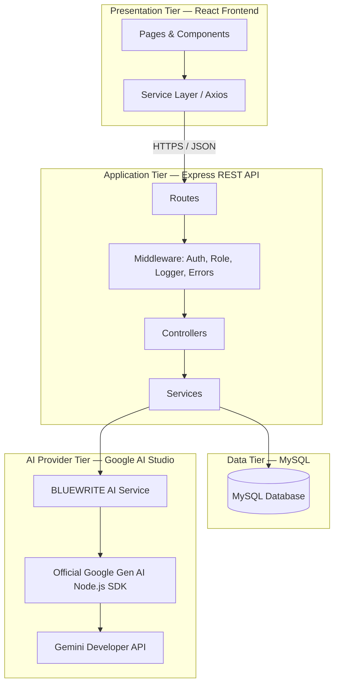
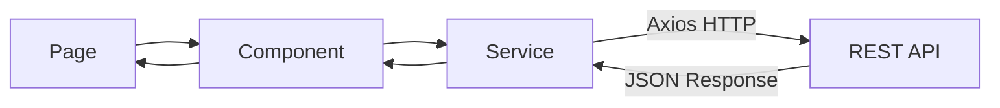
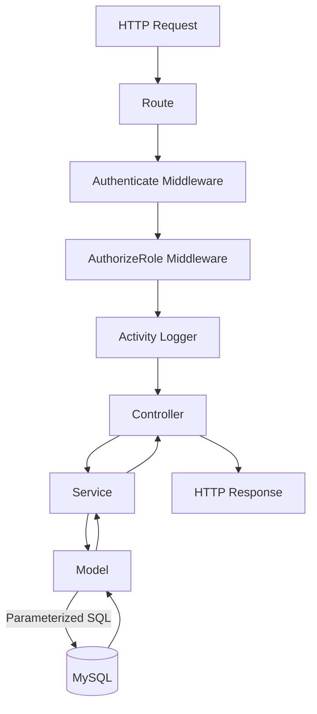
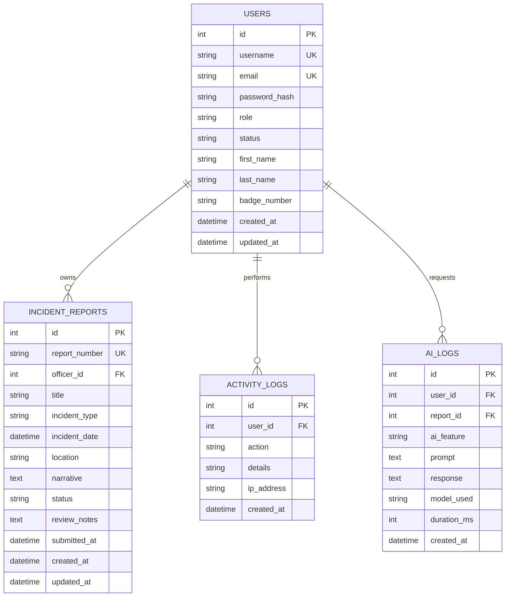
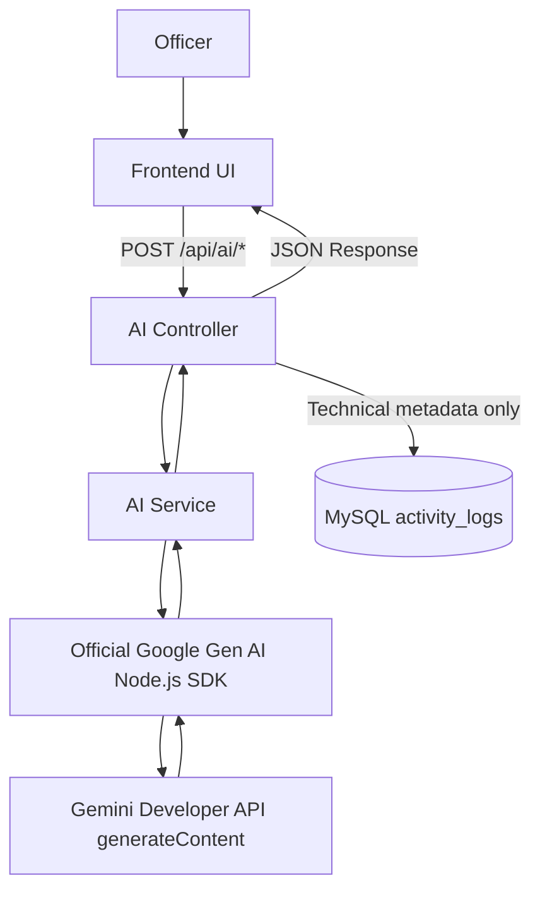
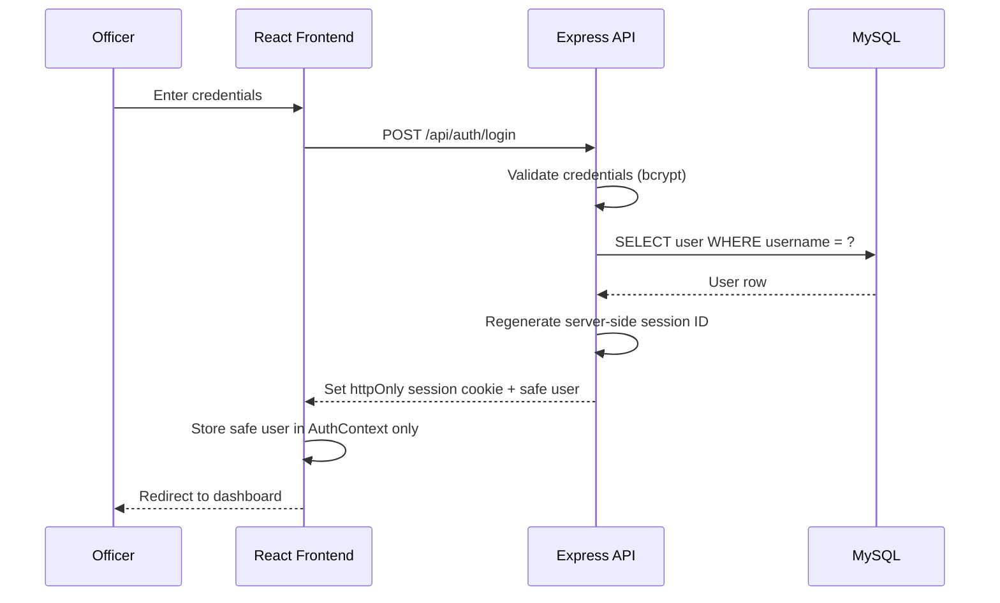
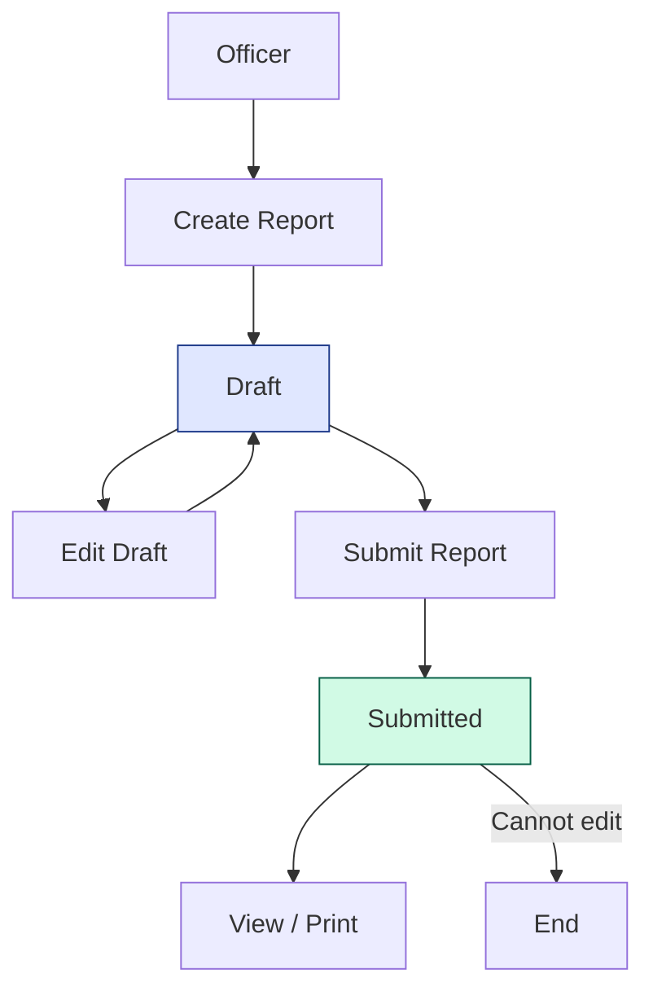

# BLUEWRITE — System Architecture

**Official Project Title:**  
BLUEWRITE: AN AI-ASSISTED REAL-TIME POLICE INCIDENT REPORT GENERATION SYSTEM

---

## 1. Overview

BLUEWRITE is a web-based police incident reporting system built as a three-tier application:

1. **Frontend (Presentation Tier)** — React single-page application
2. **Backend (Application Tier)** — Express REST API
3. **Database (Data Tier)** — MySQL relational database

The system also integrates the **BLUEWRITE AI Assistant** through the official Google Gen AI Node.js SDK and Gemini Developer API. The AI is positioned strictly behind the backend—the frontend never communicates directly with Google AI Studio or receives the API key.

---

## 2. Objectives

- Provide a professional, secure, enterprise-grade incident reporting platform.
- Enable officers to create, manage, submit, view, search, and print incident reports.
- Provide AI assistance for narrative generation and report analysis.
- Enable admins to manage officer accounts and view all reports and activity logs.
- Enforce strict data ownership so officers only access their own reports.
- Keep the AI as an assistant only — the officer always reviews and finalizes reports.

---

## 3. Technology Stack

| Layer | Technology | Purpose |
|-------|-----------|---------|
| Frontend | React | UI library |
| Frontend | Vite | Build tool and dev server |
| Frontend | Tailwind CSS | Styling and design system |
| Frontend | React Router | Client-side routing |
| Frontend | Axios | HTTP client for REST API calls |
| Frontend | Lucide React | Icon library |
| Backend | Node.js | JavaScript runtime |
| Backend | Express.js | REST API framework |
| Database | MySQL | Relational database |
| Database | mysql2 | MySQL driver for Node.js |
| Auth | Express session + MySQL session store | Server-side authenticated sessions |
| Auth | bcrypt (cost 12) | One-way password hashing |
| AI | Official Google Gen AI Node.js SDK | Backend-only provider client |
| AI | Gemini Developer API | Hosted, stateless `generateContent` narrative generation |

---

## 4. Three-Tier Architecture



---

## 5. Frontend Architecture

```
Page
  ↓
Component
  ↓
Service
  ↓
REST API
```

### Layers

| Layer | Description |
|-------|-------------|
| Pages | Route-level views (Login, Dashboard, Reports, Profile, etc.) |
| Components | Reusable UI building blocks (common, layout, reports, AI) |
| Services | Axios-based API client modules |
| Context | AuthContext for session/role state |
| Hooks | `useAuth`, `useDebounce` custom hooks |
| Utils | Formatting helpers, constants, print logic |

### Frontend Flow



### Frontend Folder Structure

```
frontend/src/
├── main.jsx
├── App.jsx
├── index.css
├── assets/
├── context/
│   └── AuthContext.jsx
├── hooks/
│   ├── useAuth.js
│   └── useDebounce.js
├── services/
│   ├── api.js
│   ├── authService.js
│   ├── reportService.js
│   ├── officerService.js
│   ├── dashboardService.js
│   ├── aiService.js
│   └── googleAIService.js
├── prompts/
│   └── policeReportPrompt.js
└── utils/
│   ├── formatDate.js
│   ├── constants.js
│   └── printReport.js
├── components/
│   ├── common/
│   ├── layout/
│   ├── reports/
│   └── ai/
└── pages/
    ├── auth/
    ├── officer/
    └── admin/
```

---

## 6. Backend Architecture

```
Route
  ↓
Controller
  ↓
Service
  ↓
Model
  ↓
MySQL
```

### Layers

| Layer | Responsibility |
|-------|---------------|
| Route | Defines HTTP endpoints and attaches middleware |
| Middleware | Authentication, role authorization, activity logging, error handling |
| Controller | Handles HTTP request/response, validation dispatch, calls services |
| Service | Business logic, orchestration, AI service calls |
| Model | Database queries using parameterized SQL |
| Database | MySQL storage |

### Backend Flow



### Backend Folder Structure

```
backend/src/
├── app.js
├── config/
│   ├── db.js
│   └── env.js
├── routes/
│   ├── authRoutes.js
│   ├── officerRoutes.js
│   ├── reportRoutes.js
│   ├── dashboardRoutes.js
│   ├── logRoutes.js
│   ├── profileRoutes.js
│   └── aiRoutes.js
├── controllers/
│   ├── authController.js
│   ├── officerController.js
│   ├── reportController.js
│   ├── dashboardController.js
│   ├── logController.js
│   ├── profileController.js
│   └── aiController.js
├── services/
│   ├── authService.js
│   ├── officerService.js
│   ├── reportService.js
│   ├── dashboardService.js
│   ├── logService.js
│   ├── aiService.js
│   ├── aiFactService.js
│   └── googleAIService.js
├── prompts/
│   └── policeReportPrompt.js
├── models/
│   ├── userModel.js
│   ├── reportModel.js
│   ├── logModel.js
│   └── aiLogModel.js
├── middleware/
│   ├── authenticate.js
│   ├── authorizeRole.js
│   ├── activityLogger.js
│   └── errorHandler.js
└── utils/
│   ├── response.js
│   ├── jwt.js
    ├── password.js
    └── reportNumber.js
```

---

## 7. Database Architecture

### Tables

| Table | Purpose |
|-------|---------|
| `users` | Admin and officer accounts |
| `incident_reports` | Incident reports owned by officers |
| `activity_logs` | Audit trail of user actions |
| `ai_logs` | Record of AI assistant requests/responses |

### Entity Relationship



See [DatabaseDesign.md](DatabaseDesign.md) for the full database design.

---

## 8. AI Architecture

```
Route
  ↓
Controller
  ↓
AI Service
  ↓
Official Google Gen AI Node.js SDK
  ↓
Gemini Developer API
```

### AI Flow



### Critical Rule

**The frontend must NEVER communicate directly with Google AI Studio or receive the Google AI Studio API key.** All AI requests must pass through the authenticated Express REST API.

### BLUEWRITE AI Assistant Features

1. **Generate Report** — drafts the editable BLUEWRITE report fields from the Officer-provided narrative; unsupported fields remain blank.
2. **Analyze Report** — checks a report for grammar, clarity, completeness, consistency, and missing information.

The AI is an assistant only. The officer reviews and finalizes all output.

---

## 9. Security Architecture

### Authentication

- Officers and admins log in with credentials.
- Passwords are hashed with **bcrypt** — never stored in plaintext.
- Authentication uses an `httpOnly`, `SameSite=Strict` session cookie whose opaque ID maps to a server-side MySQL session.
- Session IDs are regenerated after login and password changes.
- Officer sessions use the configured rolling lifetime. Administrator sessions use a one-hour idle timeout and all sessions have an eight-hour absolute maximum by default.
- Protected routes reload the current account and role from MySQL on every request.
- Five failed Officer logins create an indefinite security lock that only an Administrator can clear. This is separate from account activation status.
- Five failed Administrator logins create a 15-minute temporary lock. The next successful login requires an Administrator Security Review before dashboard access.
- Login controls include progressive delays, IP-plus-username throttling, an additional IP-wide LAN throttle, and optional Administrator workstation IP allowlisting.
- Login and security audit events record the source IP. IP addresses identify network endpoints and must be correlated with DHCP/router and device records when investigating.
- Offline TOTP/recovery-code authentication is reserved for future hardening and is not implemented.
- Officers complete a second login step using a six-digit code delivered to their Admin-managed email through Gmail SMTP. Password success creates only a restricted pending-verification session; the authenticated `userId` session is created after code verification.
- Verification codes expire after five minutes, are single-use, allow five attempts, and are stored only as HMAC-SHA-256 digests. Resends are limited and invalidate the previous code.
- Administrator login does not depend on Gmail. New Officer logins require internet/Gmail SMTP availability.

### Authorization

- Two roles: `admin` and `officer`.
- `authorizeRole` middleware restricts endpoints by role.
- Officers can only access their **own** reports (enforced in the service/model layer, not just the UI).

### Data Protection

- All SQL queries use **parameterized queries** to prevent SQL injection.
- Input is validated on both **frontend and backend**.
- No secrets are stored in source control (`.env` files, `.gitignore`).

### Audit Trail

- `activity_logs` records user actions for accountability.
- `ai_logs` records AI assistant usage for transparency.

### Report Integrity

- Reports have only two statuses: `draft` and `submitted`.
- Submitted reports **cannot** be edited.
- There is **no approval workflow**.

---

## 10. Request Flow (Authentication Example)



---

## 11. Report Flow



---

## 12. AI Flow

```mermaid
sequenceDiagram
    participant O as Officer
    participant F as React Frontend
    participant B as Express API
    participant S as AI Service
    participant P as Gemini Developer API

    O->>F: Click "Generate Report"
    F->>B: POST /api/ai/report-assist
    B->>S: Extract and validate authorized report facts
    S->>P: Stateless generateContent request
    P-->>S: AI narrative response
    S->>S: Validate response; retry once if needed
    B->>B: Log technical metadata to activity_logs
    S-->>B: Narrative result
    B-->>F: Narrative text
    F-->>O: Insert into editable narrative field
```

---

## 13. Folder Structure (Full Project)

```
BLUEWRITE/
│
├── PROJECT_RULES.md
├── README.md
│
├── docs/
│   ├── Architecture.md
│   ├── DatabaseDesign.md
│   ├── API.md
│   ├── DevelopmentPhases.md
│   ├── AIIntegration.md
│   ├── UserFlows.md
│   ├── UI-Design.md
│   └── Testing.md
│
├── backend/
│   ├── server.js
│   ├── .env.example
│   ├── .gitignore
│   ├── package.json
│   ├── database/
│   │   ├── schema.sql
│   │   └── seeds/
│   │       └── adminSeed.js
│   └── src/ ...
│
└── frontend/
    ├── index.html
    ├── vite.config.js
    ├── tailwind.config.js
    ├── postcss.config.js
    ├── .env.example
    ├── .gitignore
    ├── package.json
    └── src/ ...
```

---

## 14. Status

This document describes the **planned architecture**. Implementation has not started yet. The project is **under development**.