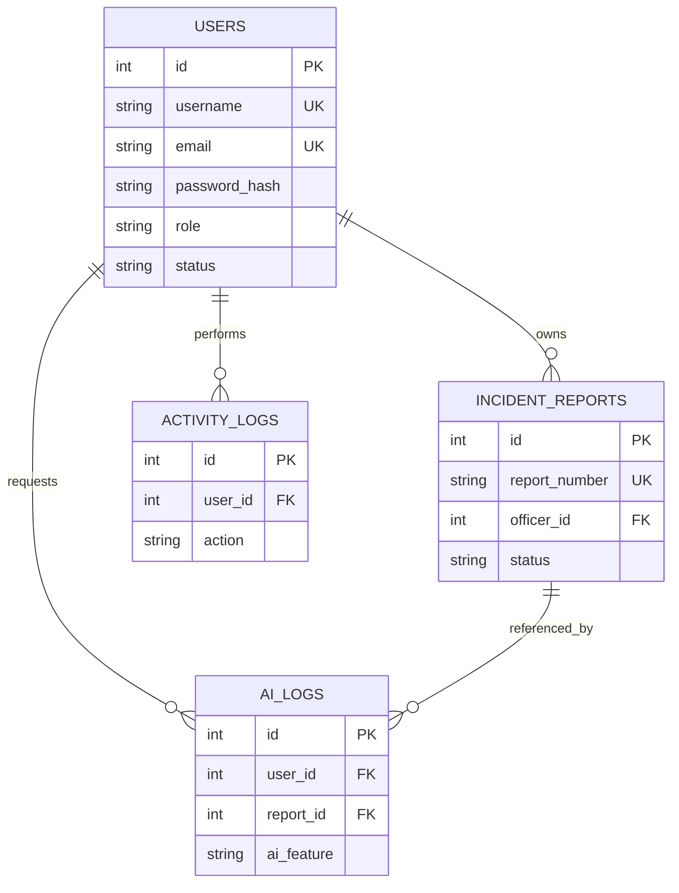

# BLUEWRITE — Database Design

---

## 1. Overview

The BLUEWRITE database is a MySQL relational database that stores users, incident reports, activity logs, and AI logs.

The database supports exactly:

- **Two user roles:** `admin` and `officer`
- **Two user statuses:** `active` and `disabled`
- **Two report statuses:** `draft` and `submitted`

**There is no approval workflow.** There is no approved, rejected, or pending-approval status.

---

## 2. Core Tables

| Table | Purpose |
|-------|---------|
| `users` | Admin and police officer accounts |
| `incident_reports` | Incident reports created by officers |
| `activity_logs` | Audit log of user actions |
| `ai_logs` | Log of BLUEWRITE AI Assistant requests/responses |

---

## 3. Table Designs

### 3.1 `users`

Stores all user accounts (admins and officers).

| Field | Type | Null | Key | Default | Description |
|-------|------|------|-----|---------|-------------|
| `id` | INT | No | PK, Auto Increment | — | Unique user ID |
| `username` | VARCHAR(50) | No | Unique | — | Login username |
| `email` | VARCHAR(100) | No | Unique | — | Email address |
| `password_hash` | VARCHAR(255) | No | — | — | bcrypt hash, never plaintext |
| `first_name` | VARCHAR(50) | No | — | — | First name |
| `last_name` | VARCHAR(50) | No | — | — | Last name |
| `badge_number` | VARCHAR(20) | Yes | Unique | NULL | Officer badge number |
| `role` | ENUM('admin','officer') | No | — | 'officer' | User role |
| `status` | ENUM('active','disabled') | No | — | 'active' | Account status |
| `last_login_at` | DATETIME | Yes | — | NULL | Last successful login |
| `must_change_password` | BOOLEAN | No | — | false | Force first-login password replacement |
| `account_locked` | BOOLEAN | No | Index | false | Indefinite Officer security lock requiring Admin unlock |
| `security_review_required` | BOOLEAN | No | Index | false | Require Admin review after suspicious login activity |
| `failed_login_attempts` | INT UNSIGNED | No | — | 0 | Consecutive unsuccessful login count |
| `locked_until` | DATETIME | Yes | Index | NULL | Temporary lockout expiration |
| `last_login_ip` | VARCHAR(45) | Yes | — | NULL | Source IP of last successful login |
| `password_changed_at` | DATETIME | Yes | — | NULL | Last successful password change |
| `created_at` | TIMESTAMP | No | — | CURRENT_TIMESTAMP | Row creation time |
| `updated_at` | TIMESTAMP | No | — | ON UPDATE CURRENT_TIMESTAMP | Last update time |

**Notes:**

- Passwords are stored only as bcrypt hashes.
- Five failed Officer attempts lock the Officer until an Admin explicitly unlocks the account.
- Five failed Admin attempts create a 15-minute temporary lock and require Security Review after the next successful login.
- Locked, Disabled, and Must Change Password are separate account conditions.
- Existing accounts remain usable after migration; newly created Officers require a first-login password change.
- Officers are **disabled**, never deleted.
- Historical reports remain associated with the officer via `incident_reports.officer_id`.

### 3.1.1 `login_verification_challenges`

Stores short-lived Officer email-login challenges. It contains a UUID challenge ID, user foreign key, HMAC code digest, expiration, attempt/send limits, sent timestamps, and consumed timestamp. Plaintext verification codes are never stored.

---

### 3.2 `incident_reports`

Stores incident reports created by officers.

| Field | Type | Null | Key | Default | Description |
|-------|------|------|-----|---------|-------------|
| `id` | INT | No | PK, Auto Increment | — | Unique report ID |
| `report_number` | VARCHAR(30) | No | Unique | — | Human-readable unique report number |
| `officer_id` | INT | No | FK → `users.id` | — | Owning officer |
| `title` | VARCHAR(200) | No | — | — | Report title |
| `incident_type` | VARCHAR(100) | No | — | — | Incident classification |
| `incident_date` | DATETIME | No | — | — | Date/time of the incident |
| `location` | VARCHAR(255) | No | — | — | Incident location |
| `narrative` | TEXT | Yes | — | NULL | Incident narrative |
| `status` | ENUM('draft','submitted') | No | Index | 'draft' | Report status |
| `review_notes` | TEXT | Yes | — | NULL | Reserved for officer review notes (AI analysis notes) |
| `submitted_at` | DATETIME | Yes | — | NULL | When the report was submitted |
| `created_at` | TIMESTAMP | No | — | CURRENT_TIMESTAMP | Row creation time |
| `updated_at` | TIMESTAMP | No | — | ON UPDATE CURRENT_TIMESTAMP | Last update time |

**Notes:**

- Reports have exactly two statuses: `draft` and `submitted`.
- **No approval status exists.**
- Submitted reports cannot be edited.
- Report ownership is enforced by `officer_id`.

---

### 3.3 `activity_logs`

Stores a record of user actions for auditing.

| Field | Type | Null | Key | Default | Description |
|-------|------|------|-----|---------|-------------|
| `id` | INT | No | PK, Auto Increment | — | Unique log ID |
| `user_id` | INT | No | FK → `users.id` | — | User who performed the action |
| `action` | VARCHAR(100) | No | Index | — | Action name (e.g., LOGIN, CREATE_REPORT, SUBMIT_REPORT) |
| `details` | TEXT | Yes | — | NULL | Additional details as JSON or text |
| `ip_address` | VARCHAR(45) | Yes | — | NULL | IP address (supports IPv6 length) |
| `created_at` | TIMESTAMP | No | Index | CURRENT_TIMESTAMP | When the action occurred |

---

### 3.4 `ai_logs`

Stores BLUEWRITE AI Assistant usage for transparency and audit.

| Field | Type | Null | Key | Default | Description |
|-------|------|------|-----|---------|-------------|
| `id` | INT | No | PK, Auto Increment | — | Unique log ID |
| `user_id` | INT | No | FK → `users.id` | — | Officer who requested AI assistance |
| `report_id` | INT | Yes | FK → `incident_reports.id` | NULL | Associated report (if any) |
| `ai_feature` | VARCHAR(50) | No | — | — | `generate_narrative` or `analyze_report` |
| `prompt` | TEXT | No | — | — | Prompt sent to the AI |
| `response` | TEXT | Yes | — | NULL | AI response |
| `model_used` | VARCHAR(100) | Yes | — | NULL | Configured AI model name |
| `duration_ms` | INT | Yes | — | NULL | Request duration in milliseconds |
| `created_at` | TIMESTAMP | No | — | CURRENT_TIMESTAMP | When the request was made |

---

## 4. Relationships



### Relationship Summary

| Relationship | Type | Description |
|--------------|------|-------------|
| `users` → `incident_reports` | 1-to-many | An officer owns many reports |
| `users` → `activity_logs` | 1-to-many | A user performs many logged actions |
| `users` → `ai_logs` | 1-to-many | An officer requests AI assistance many times |
| `incident_reports` → `ai_logs` | 1-to-many | A report may have multiple AI log entries |

---

## 5. Keys

### Primary Keys

| Table | Primary Key |
|-------|-------------|
| `users` | `id` |
| `incident_reports` | `id` |
| `activity_logs` | `id` |
| `ai_logs` | `id` |

### Foreign Keys

| Table | Foreign Key | References |
|-------|-------------|------------|
| `incident_reports` | `officer_id` | `users(id)` |
| `activity_logs` | `user_id` | `users(id)` |
| `ai_logs` | `user_id` | `users(id)` |
| `ai_logs` | `report_id` | `incident_reports(id)` |

---

## 6. Indexes

| Table | Index | Type | Purpose |
|-------|-------|------|---------|
| `users` | `username` | Unique | Fast login lookup |
| `users` | `email` | Unique | Unique email enforcement |
| `users` | `badge_number` | Unique | Unique badge number |
| `incident_reports` | `report_number` | Unique | Unique report reference |
| `incident_reports` | `officer_id` | Index | Query reports by officer |
| `incident_reports` | `status` | Index | Filter reports by status |
| `activity_logs` | `user_id` | Index | Query logs by user |
| `activity_logs` | `created_at` | Index | Sort/filter logs by date |
| `ai_logs` | `user_id` | Index | Query AI logs by user |
| `ai_logs` | `report_id` | Index | Query AI logs by report |

---

## 7. Constraints

### Enforced Rules

1. `users.role` must be `admin` or `officer` (ENUM).
2. `users.status` must be `active` or `disabled` (ENUM).
3. `incident_reports.status` must be `draft` or `submitted` (ENUM).
4. Usernames, emails, and badge numbers must be unique.
5. Report numbers must be unique.
6. `incident_reports.officer_id` must reference an existing user.
7. An officer can only access reports where `incident_reports.officer_id = current_user.id`.

---

## 8. Report Ownership

- Every report has an `officer_id` foreign key that determines ownership.
- Officers can only:
  - Create reports (owner = themselves)
  - Edit reports where `status = 'draft'` and `officer_id = themselves`
  - View reports where `officer_id = themselves`
  - Submit reports where `officer_id = themselves` and `status = 'draft'`

- Admins can view all reports but **cannot approve or edit** them.
- Submitted reports are read-only for everyone.

---

## 9. User Roles and Statuses

### Roles

| Role | Value | Description |
|------|-------|-------------|
| Admin | `admin` | Can manage officers, view all reports, view logs |
| Police Officer | `officer` | Can create/manage their own reports |

### Statuses

| Status | Value | Description |
|--------|-------|-------------|
| Active | `active` | Account can log in and use the system |
| Disabled | `disabled` | Account cannot log in; data is preserved |

**Important:** Officers are **disabled** rather than deleted. Disabling preserves historical report associations (reports remain linked to the original officer via `officer_id`).

---

## 10. Report Statuses

| Status | Value | Description |
|--------|-------|-------------|
| Draft | `draft` | In progress; editable by the owning officer |
| Submitted | `submitted` | Finalized; read-only |

**There is no approval workflow.**

- No `approved` status
- No `rejected` status
- No `pending_approval` status
- No admin approval step

The report lifecycle is simply:

```
draft → submitted
```

---

## 11. Status

This document describes the **planned database design**. The database has not been created or configured yet. Implementation will begin in a later phase.