# BLUEWRITE — User Flows

---

## Overview

This document describes the key user flows for the BLUEWRITE application for both admins and police officers.

All flows assume the implementation is complete. The project is currently **under development**; these flows are the planned behavior.

**Key rules:**

- Reports have only two statuses: `draft` and `submitted`.
- There is **no approval workflow**.
- Officers can only access their own reports.
- Submitted reports cannot be edited.
- Officers are disabled rather than deleted.
- The AI is an assistant only.

---

## 1. Officer Login

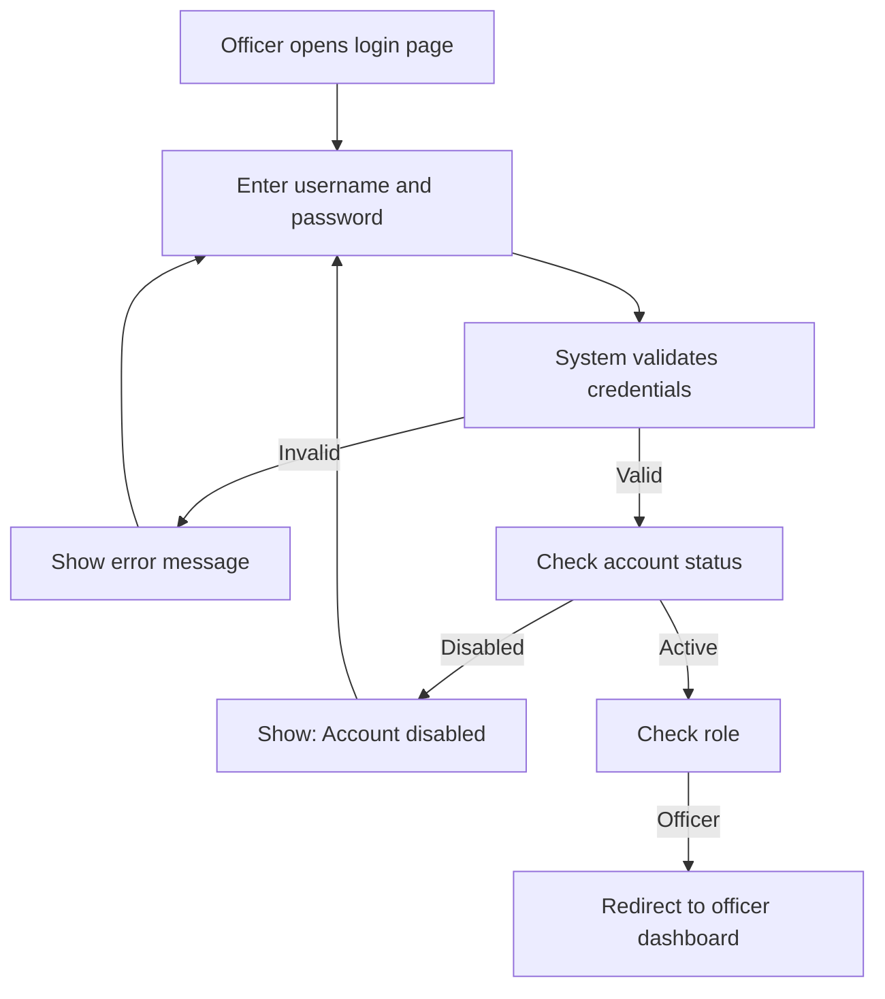

**Notes:**

- Disabled officers cannot log in.
- Login is recorded in `activity_logs`.

---

## 2. Admin Login

---

## 3. Create Draft

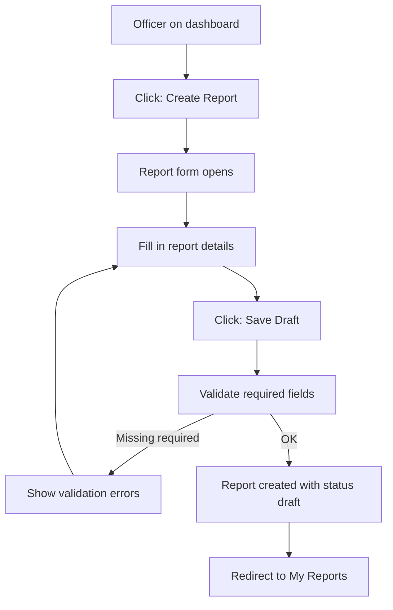

**Notes:**

- A new report is always created as a `draft`.
- A unique report number is generated.
- The report is owned by the creating officer.

---

## 4. Edit Draft

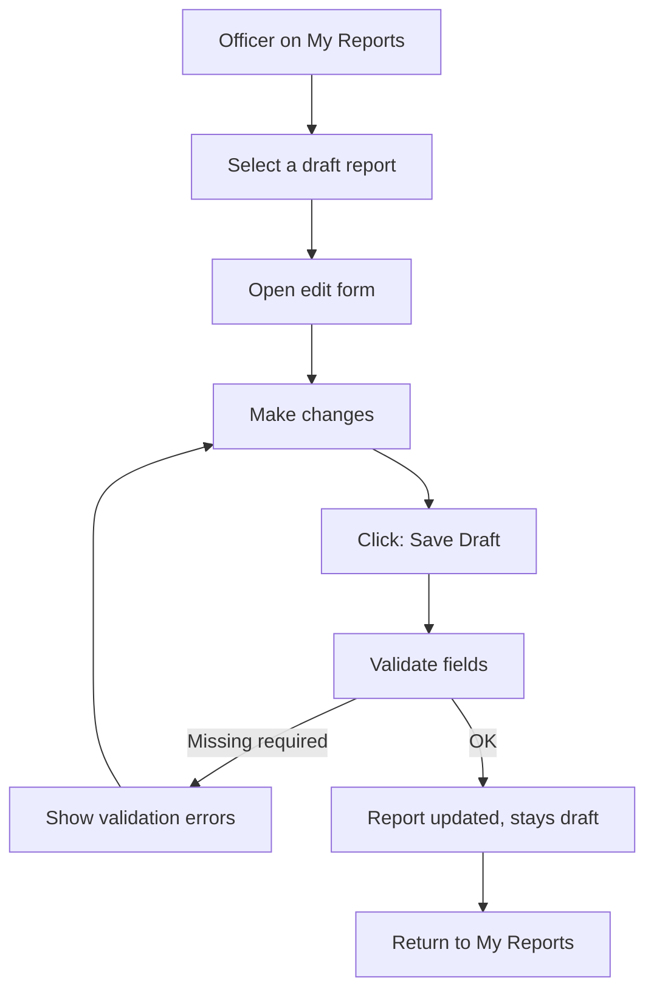

**Constraints:**

- Only the owning officer can edit.
- Only `draft` reports can be edited.
- Submitted reports cannot be edited (edit option hidden; backend rejects).

---

## 5. Generate AI Report from Narrative

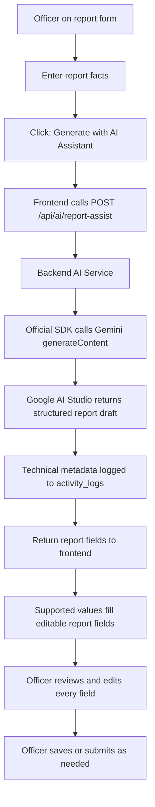

**Key points:**

- The AI output is **editable** by the officer.
- The AI never saves or submits automatically.
- The frontend never talks to Google AI Studio directly and never receives the API key.

---

## 6. Analyze Report

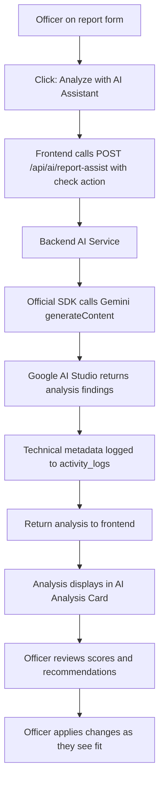

**Key points:**

- Analysis covers grammar, clarity, completeness, consistency, and missing information.
- The analysis is for assistance only.
- The officer decides what, if anything, to change.

---

## 7. Submit Report

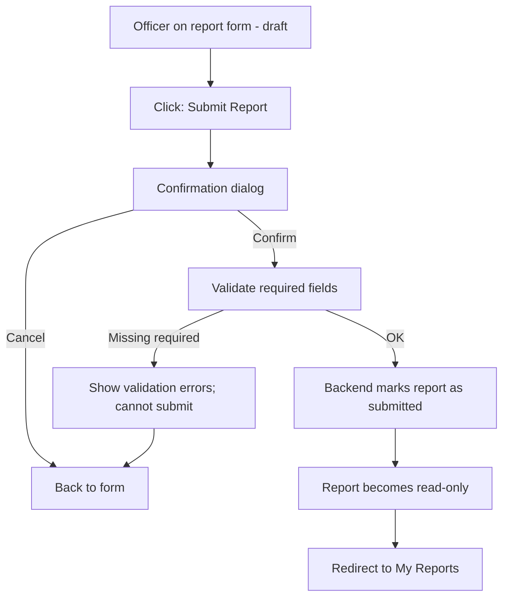

**Key points:**

- Submitting changes status from `draft` to `submitted`.
- `submitted_at` is recorded.
- After submission, the report cannot be edited.
- There is no approval step — submission is final.

---

## 8. View Own Reports

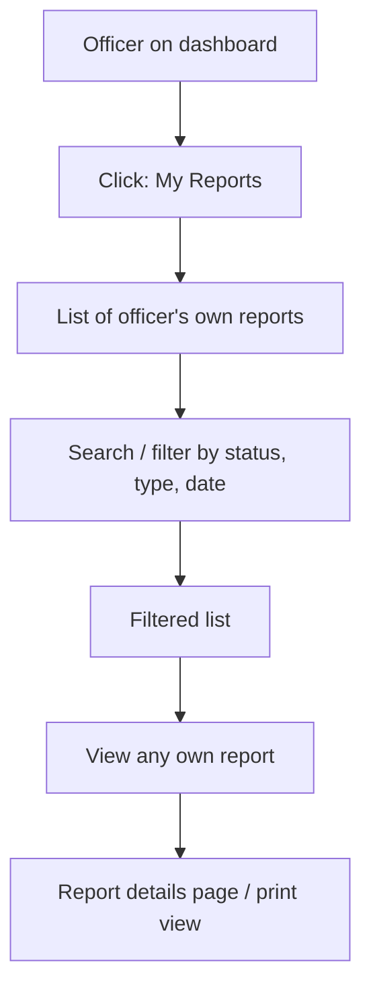

**Notes:**

- Officers only ever see their own reports.
- Ownership is enforced on the backend, not just the UI.

---

## 9. Print Report

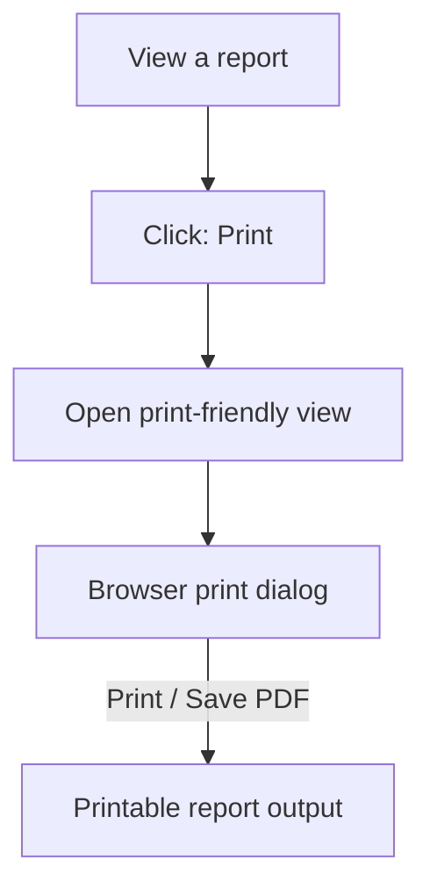

**Notes:**

- Available to officers for their own reports.
- Available to admins for any report.
- Print view is clean and professional.

---

## 10. Manage Officers (Admin)

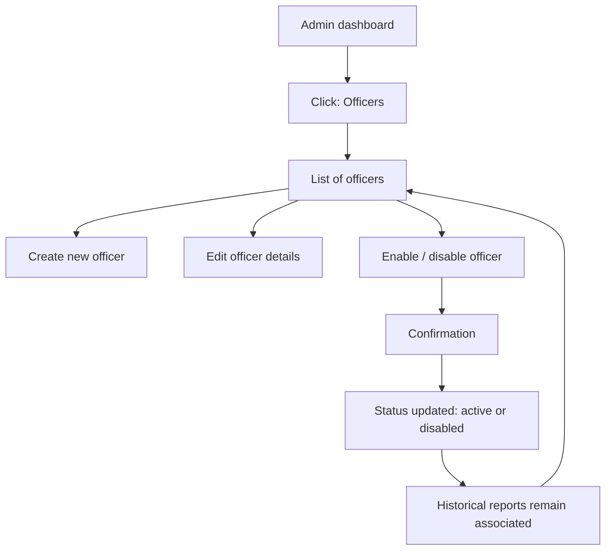

**Key points:**

- Officers are **disabled**, never deleted.
- A disabled officer cannot log in.
- Disabling preserves report history.

---

## 11. Admin View Reports

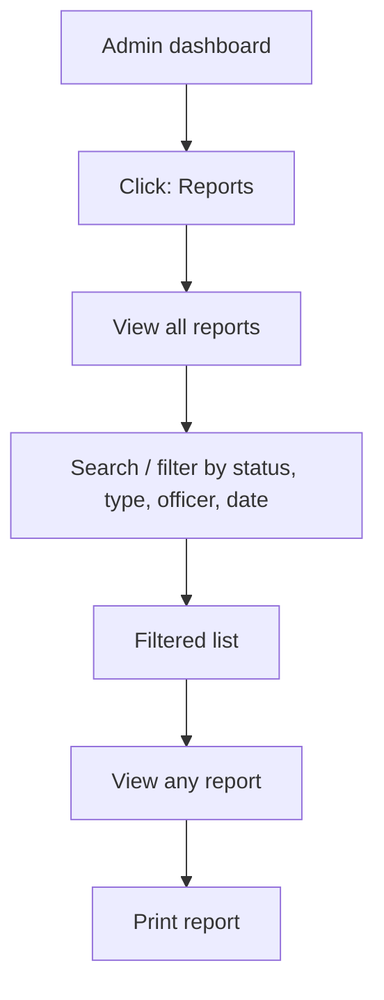

**Notes:**

- Admins can view all reports but **cannot approve or edit** them.
- There is no approval workflow.

---

## 12. Activity Logs (Admin)

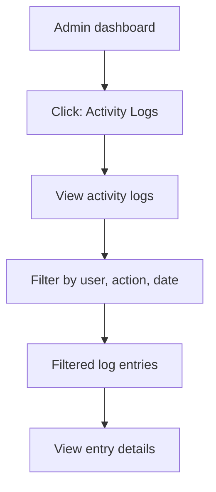

**Notes:**

- Logs record user actions (login, report creation, submission, AI usage, etc.).
- Accessible to admins only.

---

## Flow Summary

| # | Flow | Primary Actor | Key Rule |
|---|------|---------------|----------|
| 1 | Officer Login | Officer | Disabled accounts cannot log in |
| 2 | Admin Login | Admin | Disabled accounts cannot log in |
| 3 | Create Draft | Officer | New reports are drafts |
| 4 | Edit Draft | Officer | Only own drafts can be edited |
| 5 | Generate AI Narrative | Officer | AI output is editable; no auto-submit |
| 6 | Analyze Report | Officer | AI is assistance only |
| 7 | Submit Report | Officer | Final; no approval step |
| 8 | View Own Reports | Officer | Own reports only |
| 9 | Print Report | Officer / Admin | Clean print view |
| 10 | Manage Officers | Admin | Disable, never delete |
| 11 | Admin View Reports | Admin | View only, no approval |
| 12 | Activity Logs | Admin | Audit trail |

---

## Status

This document describes the **planned user flows**. Implementation has not started yet. The project is **under development**.